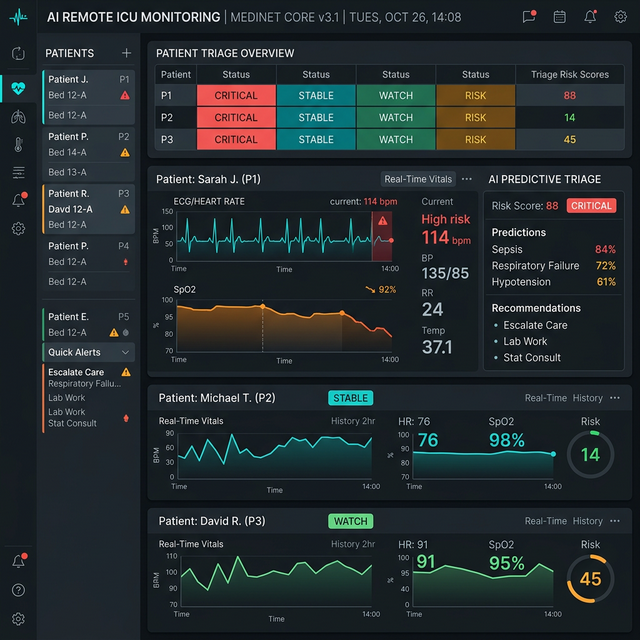

# 🏥 VITALGUARD 2.0
### AI-Based Remote ICU Monitoring & Predictive Triage System



**VitalGuard 2.0** is a next-generation healthcare platform designed for real-time ICU patient monitoring and predictive analytics. By leveraging machine learning (XGBoost), it provides medical professionals with early warnings for patient deterioration, high-accuracy risk scores, and automated triage prioritization.

---

## 🌟 Key Features

*   **⚡ Real-time ICU Command Center**: A centralized dashboard to monitor multiple patients across different beds simultaneously.
*   **🤖 Smart Triage Core (XGBoost)**: Advanced AI model that predicts patient risk levels based on vital signs (Heart Rate, SpO2, Blood Pressure, etc.).
*   **📊 Intelligent Alert Engine**: Automatically triggers alerts when vital signs cross critical thresholds or show sudden spikes.
*   **📈 Predictive Analytics**: Visualizes historical data and provides forecasts for vital sign trends.
*   **📝 Automated Medical Reports**: Generates comprehensive reports for patient status and history.
*   **🚨 Crisis Simulation Mode**: A built-in simulator to stress-test clinical responses by triggering multi-patient deterioration scenarios.
*   **📱 Modern Responsive UI**: A sleek, dark-mode optimized interface built for desktop and tablet ICU monitors.

---

## 🛠️ Technology Stack

### **Backend**
- **Framework**: [FastAPI](https://fastapi.tiangolo.com/) (Python)
- **AI/ML**: [XGBoost](https://xgboost.readthedocs.io/), [Scikit-learn](https://scikit-learn.org/)
- **Data Processing**: [Pandas](https://pandas.pydata.org/), [NumPy](https://numpy.org/)
- **Infrastructure**: [Pydantic](https://docs.pydantic.dev/) for data validation, [Uvicorn](https://www.uvicorn.org/) as ASGI server
- **Storage/Integration**: [Firebase Admin SDK](https://firebase.google.com/docs/admin/setup)

### **Frontend**
- **Framework**: [React 18](https://reactjs.org/) with [Vite](https://vitejs.dev/)
- **Styling**: [Tailwind CSS](https://tailwindcss.com/)
- **Charts**: [Chart.js](https://www.chartjs.org/) & [React-Chartjs-2](https://react-chartjs-2.js.org/)
- **Icons**: [Lucide React](https://lucide.dev/)
- **Routing**: [React Router](https://reactrouter.com/)

---

## 📂 Project Structure

```bash
vitalguard2/
├── backend/            # Python FastAPI backend
│   ├── main.py         # Entry point
│   ├── models/         # XGBoost model definitions
│   ├── routers/        # API endpoints (patients, vitals, alerts, simulation)
│   ├── services/       # Business logic & ML inference
│   └── requirements.txt
├── frontend/           # Vite + React frontend
│   ├── src/
│   │   ├── components/ # Reusable UI components
│   │   ├── pages/      # Full-page views
│   │   ├── api/        # Axios configurations
│   │   └── App.jsx     # Main application & routing
│   └── package.json
└── data/               # Model weights and sample datasets
```

---

## 🚀 Getting Started

### **Prerequisites**
- Python 3.9+
- Node.js 18+
- npm or yarn

### **Backend Setup**
1. Navigate to the backend directory:
   ```bash
   cd backend
   ```
2. Create and activate a virtual environment:
   ```bash
   python -m venv venv
   source venv/bin/activate  # On Windows: venv\Scripts\activate
   ```
3. Install dependencies:
   ```bash
   pip install -r requirements.txt
   ```
4. Start the server:
   ```bash
   uvicorn main:app --reload
   ```
   *The API will be available at `http://127.0.0.1:8000`*
   *Interactive docs at `http://127.0.0.1:8000/docs`*

### **Frontend Setup**
1. Navigate to the frontend directory:
   ```bash
   cd frontend
   ```
2. Install dependencies:
   ```bash
   npm install
   ```
3. Run in development mode:
   ```bash
   npm run dev
   ```
   *The dashboard will be available at `http://localhost:5173`*

---

## 🛡️ ICU Risk Monitoring
VitalGuard calculates a **Risk Score (0-100)** for every patient every 5 seconds.
- **🟢 0-30 (Low Risk)**: Stable condition, regular monitoring.
- **🟡 31-70 (Moderate Risk)**: Potential deterioration, clinical review required.
- **🔴 71-100 (High Risk)**: Critical deterioration, immediate intervention recommended.

---

## 🤝 Contributing
1. Fork the Project
2. Create your Feature Branch (`git checkout -b feature/AmazingFeature`)
3. Commit your Changes (`git commit -m 'Add some AmazingFeature'`)
4. Push to the Branch (`git push origin feature/AmazingFeature`)
5. Open a Pull Request

---

## 📄 License
Distributed under the MIT License. See `LICENSE` for more information.

---
**Disclaimer**: VitalGuard is a medical research project and should be used as a decision-support tool, not as a replacement for professional clinical judgment.
